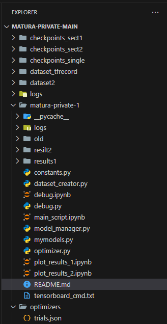

# Anleitung

# Um trainingsergebnisse anzuschauen plot_results_1.ipynb, plot_results_2.ipynb ausführen.

# Um den Versuch nachzumachen, im constants.py File, folgende variabeln setzen:

main_folder = '../'

dataset1_folder = main_folder + 'dataset_tfrecord' + '/'

dataset2_folder = main_folder + 'dataset2' + '/'

# Diese Variabeln müssen auf existente Folders zeigen. Hier werden die Datensätze gespeichert.

# Zusätzlich müssen folgende Folders erstellt werden:

  SECT1_CHECKPOINT_FOLDER = main_folder + 'checkpoints_sect1' + '/'
  
  SECT2_CHECKPOINT_FOLDER = main_folder + 'checkpoints_sect2' + '/'
  
  SINGLE_CHECKPOINT_FOLDER = main_folder + 'checkpoints_single' + '/'
  
  OPTIMIZER_FOLDER = main_folder + 'optimizers' + '/'
  

# In diesen Foldern werden Trainingsdaten gespeichert.

# Schlussendlich kann main_script.ipynb ausgeführt
## Achtung! Die Datensatzerstellung braucht viel Arbeittspeicher, ich empfehle sicherzustellen, dass mindestens 12 GB freier Arbeitsspeicher vorhanden ist
## Achtung! Das Training der Modelle erfordert ebenfalls viel Arbeitsspeicher. Falls nicht genug Arbeitsspeicher vorhanden ist, kann es sein, dass bei einigen Netzwerkstrukturen, der Code eine Errormeldung gibt. Es ist möglich diese zu ignorieren, ich empfehle jedoch in diesem Fall im constants.py, die Batch_Size auf einen tieferen Wert zu setzen.

Jede Zelle in main_script.ipynb optimiert ein neues Modell oder generiert einen Datensatz. Falls ein Datensatz generiert wird, immer die Ordner leeren vor dem Generieren. Falls ein Modell trainiert wird, den entsprechenden chechpoint-Folder leeren und den optimizer-Folder auch.

# Als Beispiel habe ich meine Folders als Bild eingefügt.

